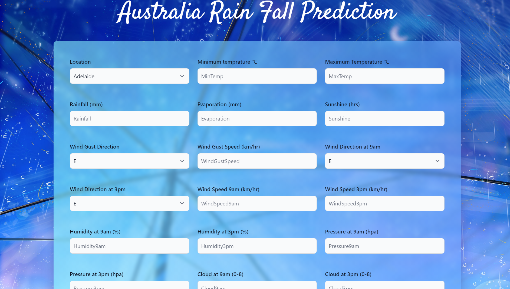

# Rainfall_Prediction
A Rainfall Prediction project which is build on [AUS Rainfall dataset](https://www.kaggle.com/jsphyg/weather-dataset-rattle-package) from kaggle. There were missing values and outliers in dataset. The data is pre-processed and many models were trained. The accuracies are given below:-

* Logistic Regression : 84.37% 
* Decision Tree :       78.86% 
* Random Forest :       85.73% 
* Naive Bayes :         80.37%  
* Gradient Boost :      85.63% 
* XGBoost :             86.01%  

# Website Link :
[https://rainfall-prediction-8899.onrender.com/](https://rainfall-prediction-8899.onrender.com/)

# How to run this app
* Install python,conda.
* git clone https://github.com/bhushanpatil88/Rainfall_Prediction.git
* Then install all the packages by using the following command
* pip install -r requirements.txt.
* To run the app: python app.py.

# Tech Used
 * Front-End: HTML,CSS,TAILWIND CSS.
 * Back-End: Flask Framework.
 * IDE : JUPYYER NOTEBOOK.

# Some screenshots of the website
* Home Page:

* Rain:

* No Rain:
 

# Workflow

# Data Collection: 
[Rainfall Prediction in Australia dataset](https://www.kaggle.com/jsphyg/weather-dataset-rattle-package) from Kaggle
# Data Preprocessing: 
* Missing Values Handling : Few columns like Rainfall and Evaporation contained more than 43% missing values.
* Missing values of numerical columns is replaced with Median and Categorial columns is replaced with Mode.
* Categorical columns like location, wind direction were One Hot Encoded. 
* Outliers : They were detected using Boxplot. Outliers were removed using RobustScaler.
* EDA was performed on each categorical and numerical column.
* All Data Preprocessing and EDA is done in RainFall_Preprocessing_EDA.ipynb 

# Model Creation:
* Different types of models were comapared like logistic regression, random forest, naive bayes, gradient boost.
* Out of these xgboost, gradient boost, random forest performed the best.
* Accuracy score and all the classification metrices of each model is displayed in Model.ipynb

# Model Production
* XGBoost gave the highest accuracy of around 86.01% which was verified using croos validation.
* Different parameter tuning was done manually to select best parameters for xgboost. Total 500 estimators were trained.
* A pipe is formed in which SimpleImputer and OneHotEncoder is used for preprocessing. Then a pickle file was created.
* All the production code is available in Production.ipynb

# Model Deployment
* The model is deployed using Flask at render server at the [website](https://rainfall-prediction-8899.onrender.com/)

# If you like this project please do give a star. Giving our LinkedIn profiles.
* Model Creator and Backend developer
[Bhushan Patil](https://www.linkedin.com/in/bhushan18/)
* Frontend and backend developer 
[Kunal Patil](https://www.linkedin.com/in/kunal0007/)

